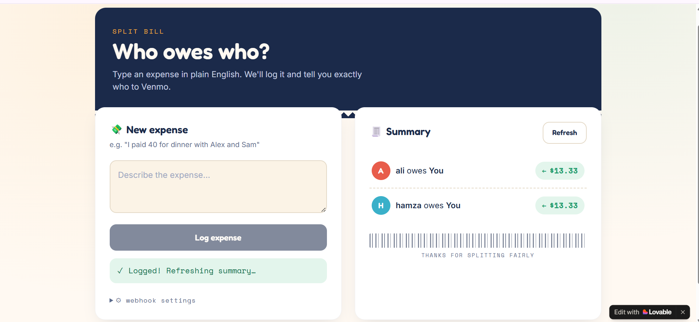
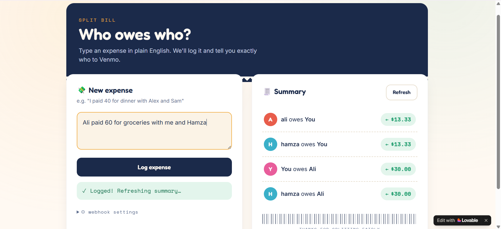
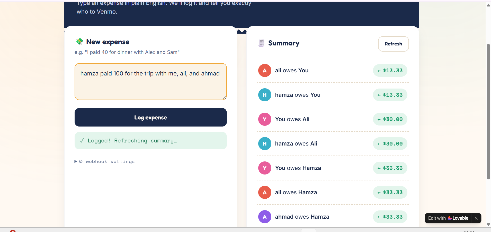

# 💸 Who Owes Who — Split Bill

A tiny app that turns a plain-English sentence into a settled bill.

Type **"I paid 40 for dinner with Alex and Sam"** — it logs the expense, splits it automatically, and tells you exactly who owes who. No manual math, no spreadsheet gymnastics.

**🔗 Live app:** [https://who-owws-who.lovable.app](https://who-owws-who.lovable.app)

---

## How it works

```
┌────────────┐      ┌───────────────────────────────┐      ┌───────────────┐
│  Frontend  │ ───▶ │            n8n Backend          │ ───▶ │ Google Sheets │
│ (Lovable)  │      │  Webhook → AI → Code → Sheets   │      │   (Ledger)    │
└────────────┘      └───────────────────────────────┘      └───────────────┘
                                   │
                                   ▼
                            OpenAI (GPT-4o-mini)
                     parses natural language → JSON
```

The app is a thin UI in front of two automated n8n workflows:

### 1. Log Expense (`POST /webhook/log`)
1. **Webhook** receives the raw message (e.g. *"I paid 40 for dinner with Alex and Sam"*)
2. **AI node (GPT-4o-mini)** extracts structured data: `amount`, `payer`, `participants`, `total_people`
3. **Code node** calculates each person's share and stamps the date
4. **Google Sheets** appends a new row to the ledger
5. **Respond to Webhook** sends back a plain-English confirmation

### 2. Summary (`GET /webhook/summary`)
1. **Webhook** receives the request
2. **Google Sheets** reads every logged row
3. **AI node** reasons across all entries and works out net balances
4. **Respond to Webhook** returns a plain-English settlement summary (e.g. *"Alex owes You $13.33. Sam owes You $13.33."*)

---

## Tech stack

| Layer | Tool |
|---|---|
| Frontend | [Lovable](https://lovable.dev) |
| Automation / backend | [n8n](https://n8n.io) |
| Natural language parsing | OpenAI GPT-4o-mini |
| Data storage | Google Sheets |

No traditional backend server or database was written by hand — the entire logic layer is a visual n8n workflow calling an AI model and a spreadsheet.

---

## Why I built this

Splitting a bill between friends always ends the same way: someone doing quiet mental math while everyone else waits. This app removes that step entirely — describe the expense the way you'd say it out loud, and get the answer back the same way.

It's also a small proof of concept for how far no-code/low-code tooling plus an LLM can go without writing a traditional backend: a webhook, an AI call, a spreadsheet, and a response — that's the whole system.

---
###  app — Split the Bill


## Test cases

Below are real runs against the live workflow, from initial setup through to a working end-to-end split.

### Test Case 1


Initial webhook and AI parsing setup — confirming the n8n workflow correctly receives the incoming expense message.

### Test Case 2


AI parser extracting structured JSON (`amount`, `payer`, `participants`, `total_people`) from a plain-English expense sentence.

### Test Case 3


Split calculation and Google Sheets logging — confirming the ledger updates correctly with the computed share per person.


The finished UI: type an expense, log it, and view a live "who owes who" settlement summary styled as a receipt.

> **Note:** GitHub can't reliably render image filenames containing spaces. If `split the bill.png` doesn't display, rename it to `split-the-bill.png` (and update the link above to match).

---

## Setup (if you want to run your own version)

1. **Google Sheets** — create a sheet with columns: `Date`, `Payer`, `Amount`, `Participants`, `Share Each`
2. **n8n** — build two workflows:
   - `POST /log` → Webhook → AI parser → Code (split logic) → Google Sheets (Append Row) → Respond to Webhook
   - `GET /summary` → Webhook → Google Sheets (Read Rows) → AI summarizer → Respond to Webhook
3. **Frontend** — point your app (Lovable, or the standalone HTML version) at your two production webhook URLs
4. Publish/activate both n8n workflows and you're live

---

## Roadmap ideas

- [ ] Support multiple payers within a single message
- [ ] Add authentication to the webhooks before sharing with a wider group
- [ ] Track settled vs. unsettled debts (mark as paid)
- [ ] Multi-currency support

---

Built as a weekend project — proof that the gap between "I have an idea" and "I have a working app" keeps getting smaller.
